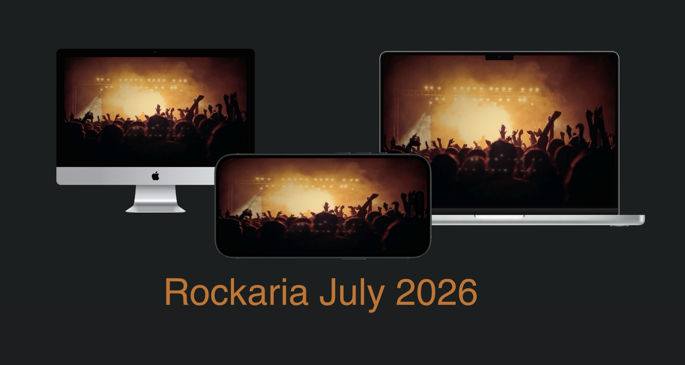
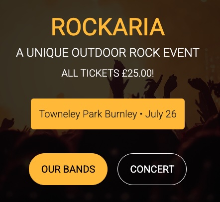

# 🎸 Rockaria 

Code Institute MP4 Rockaria project built by Mark Curran

Heroku URL - https://git.heroku.com/rockaria.git   

Github URL - https://github.com/curran68/rockaria.git

# 🎸 Django Rockaria

Django Rockaria is a web application built with Django, designed to showcase the power of a structured backend paired with dynamic content. This project is based on a one music event (One Day Only).

## 🔍 Overview

- Framework: Django
- Database: SQLite (default)
- Language: Python
- Template Engine: Django templates
- Bootstrap 5
- Microsoft VSCode
- Stripe Payment System

## 🛠️ Getting Started

## User Stories 🎯

- **As a concertgoer**, I want to easily search for upcoming gigs by genre and location, so I can find events that match my taste and schedule.
- **As a music lover**, I want to enjoy the atmosphere, music and the environment whether it be indoor or outdoor events.
- **As a band member**, I want to see audience feedback and engagement stats, so I can plan my next tour with better insights.
- **As a first-time visitor**, I want a smooth, visually engaging homepage that guides me effortlessly to popular events and easy ticket booking.
- **As a returning user**, I want a great variety and quick access to my past bookings, so I can keep discovering music without starting from scratch.

## Homepage on Different Devices

### Mobile

### Laptop

### iMac

  
  
  

