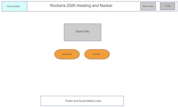

# 🎸 Rockaria 

Code Institute MP4 Rockaria project built by Mark Curran

Heroku URL - https://git.heroku.com/rockaria.git   

Github URL - https://github.com/curran68/rockaria.git

Live Site -  https://rockaria-48839712a53e.herokuapp.com/

# 🎸 Django Rockaria

Django Rockaria is a web application built with Django HTML, CSS, Bootstrap and Java. I designed this project showcase the power of a structured backend paired with dynamic content. This project is based on a one music event (One Day Only).
Towneley Park Burnley, Lancashire, is the planned venue for the music event, where I have previously attended a music openair concert and found it to be an ideal location.  

## 🔍 Overview

- Framework: Django
- Database: SQLite (default)
- Language: Python
- Template Engine: Django templates
- Bootstrap 5 Used Throughout
- Microsoft VSCode
- Stripe Payment System
- Postgres / Amazon WebServices
- Java
- HTML
- Custom CSS
- Deployed To Heroku

## 🔍 Typeface, Colours and Fonts

- Font Awesome
- Google Fonts
- Uniformed Colours

## Colours Used

I have used a simple colour scheme, which makes it not only stand out but also striking.

## 🛠️ Getting Started

## User Stories 🎯

- **As a concertgoer**, I want to easily search for upcoming gigs by genre and location, so I can find events that match my taste and schedule.
- **As a music lover**, I want to enjoy the atmosphere, music and the environment whether it be indoor or outdoor events.
- **As a first-time visitor**, I want a smooth, visually engaging homepage that guides me effortlessly to popular events and easy ticket booking.
- **As a returning user**, I want a great variety and quick access to my past bookings, so I can keep discovering music without starting from scratch.

| Type                  | Feedback                             | 
|-----------------------|--------------------------------------|
| Concertgoer           | Suited my needs.                     | 
| Music Lover           | This type of venue is great.         | 
| First Time Visitor    | Ideal design great to navigate.      | 
| Returning User        | Platform ideal for another concert.  | 

## Homepage on Different Devices

### Mobile - Laptop - iMac

  
  
  

## Homepage Example 

### Image of homepage

  

# Info About The Concert

## My First Project Of This Nature

- Venue is Towneley Park Burnley, Lancashire (Outdoor Event)
- Date Planned 4th July 2026
- Ticket Price £25.00 Each

# Method Of Building

Within Microsoft Visual Studio Code, using Django, Python and 
Java I set about designing and building the framework
to create Rockaria. The idea of Rockaria came about from 
my love of music and live concerts.
Also within this project I have also used HTML, CSS and Bootstrap.
Typeface and other designs are from Font Awesome and also Google Fonts.
Making sure the site is responsive across different devices.
As this is my first Django project throughout I faced challenges and 
also some demanding issues which needed thought and processes to
remedy problems along the way.

The site is deployed to Heroku.

Within the layout from the homepage, starting at the top is the 
navigation bar. Within this there is a decorative home link, also
on the right hand side of the navbar there is a link to take you to
a ticket booking page and an account section, where you can register
login etc.

Onto the middle section of the landing page an informative section 
with more information along with large buttons to highlight the bands on stage
and info regarding the location of the concert.

At the bottom there is the footer section with links to a contact form,
social media copyright and terms.

# Testing

From start to finish this project has been tested with functionality in 
mind.

## Lighthouse Tests

## Heroku Test

# Wireframes

